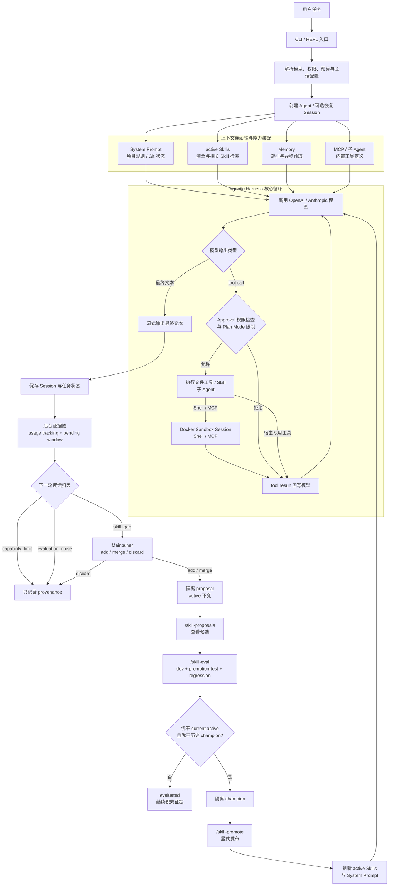
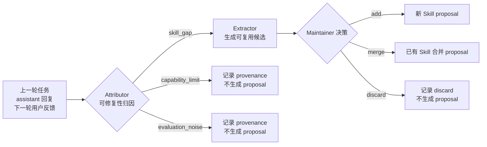
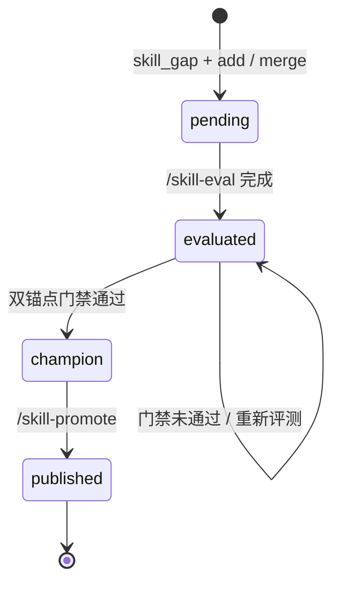
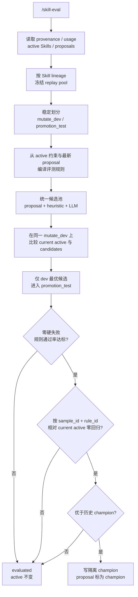

# Bear Code 当前项目流程（Single Source of Truth）

本文是 Bear Code 当前行为的唯一流程真相源，描述命令入口、模型循环、工具执行、会话保存，以及在线 Skills 从反馈归因到显式发布的完整链路。

最后校验日期：2026-08-27。

## 0. 流程文档维护协议

所有实现修改都执行 doc-first：

```text
提出修改
  -> 先阅读本文件相关章节
  -> 先更新流程说明并在变更账本登记 planned
  -> 再修改实现 / 测试 / 配置
  -> 运行对应验证
  -> 把账本状态改为 verified，并记录验证结果
```

规则：

- `RUNTIME_FLOW.md` 描述“代码当前真实怎么运行”，不是未来规划。
- README 和 wiki 是面向使用、学习、面试的派生文档；行为冲突时以本文件和代码为准，并应在同次改动中修正。
- 如果修改不改变运行流程，也要登记 `flow unchanged`，避免文档是否检查过无法追踪。
- 新记录追加在下表顶部，保留历史，不覆盖旧记录。

### 变更账本

| 日期 | 状态 | 修改 | 受影响流程 | 验证 |
| --- | --- | --- | --- | --- |
| 2026-08-27 | verified | 修正 Sandbox 生命周期事件，增加 Web 状态可观测性并补齐 Demo 测试依赖 | 第 3、7、8 节 | `pytest`: 53 passed、1 Docker integration skipped；Web build、相关 Python Ruff E9/F、全量 Python 编译与 `git diff --check` 通过 |
| 2026-08-27 | verified | 增加面向 Docker 初学者的 Sandbox 教程与专项面试 QA（flow unchanged） | 第 3、4、7 节的派生说明 | QA 61-72 编号、Markdown 代码围栏、文档链接目标与 `git diff --check` 通过 |
| 2026-08-27 | verified | 增加轻量 Docker Sandbox，分离执行隔离与用户审批，收紧文件路径和 MCP 启动边界 | 第 1、2、3、4、7、8、10 节 | `pytest`: 49 passed、1 Docker integration skipped（本机无 Docker CLI）；Ruff E9/F、Python 编译与 `git diff --check` 通过 |
| 2026-08-26 | verified | 用 Mermaid 重绘项目总流程与在线 Skill 治理图（flow unchanged） | 第 1.2、8.1、8.2 节 | 4 个 Mermaid 代码块、章节结构与 `git diff --check` 通过 |
| 2026-08-26 | verified | 重构为“项目核心总流程 → 分流程”阅读结构（flow unchanged） | 全文结构 | 章节编号、交叉引用与 `git diff --check` 通过 |
| 2026-08-26 | verified | 在线 Skill 改为 candidate-first，并建立 doc-first 维护协议 | 输入、Agent、在线 Skills、源码索引 | `pytest`: 36 passed；Ruff E9/F 与 `git diff --check` 通过 |

文中的“每一个函数”指这条运行链路上由 Bear Code 项目定义的函数。Python、`asyncio`、Rich、Anthropic/OpenAI SDK 等第三方库内部调用不展开。标有“条件”的函数只在对应分支发生。

## 1. 项目核心总流程

Bear Code 的核心不是“模型接收一句话并回复”，而是一个带安全边界、长期状态和受控能力演化的 Agentic Harness：模型负责推理和提出动作，Runtime 负责上下文组装、权限判断、工具执行、状态持久化和质量治理。

### 1.1 五个核心能力

| 核心 | 解决的问题 | 主要实现 |
| --- | --- | --- |
| Agent Loop | 让模型在“推理 → 行动 → 观察”之间循环，直到完成任务 | `agents/agent.py` |
| 工具、审批与 Sandbox | 模型只能提出 tool call；Runtime 负责审批，Docker Sandbox 负责限制 Shell/MCP 的实际可访问范围 | `agents/tools.py`、`agents/sandbox.py`、`agents/agent.py` |
| 上下文连续性 | 用 Session、上下文折叠和 Memory 保持长任务状态，同时控制上下文体积 | `agents/session.py`、`agents/memory.py` |
| 可扩展能力 | 通过 Skills、MCP 和子 Agent 扩展任务方法、外部工具与隔离执行能力 | `agents/skills.py`、`agents/mcp_client.py`、`agents/subagent.py` |
| 受控自进化 | 将用户反馈先归因、再形成 proposal，经 replay 和双锚点门禁验证后显式发布 | `agents/online_skill_evolution.py`、`agents/online_skill_eval.py` |

### 1.2 端到端总流程



其中有四条不可绕过的边界：

- 模型不能直接操作环境，所有动作都经过 Runtime 工具路由。
- Approval 只决定是否询问用户；即使是 `bypassPermissions`，Shell/MCP 仍在 Sandbox 内。只有进程启动时显式 `--unsafe-local` 才使用宿主执行。
- 后台在线演化不能直接修改 active Skill，只能生成隔离 proposal。
- `/skill-eval` 只记录 champion，只有显式 `/skill-promote` 才改变线上能力。

### 1.3 核心状态与持久化

| 状态 | 位置 | 生命周期 |
| --- | --- | --- |
| 当前模型消息与任务状态 | `.bear/sessions/` | 每次对话保存，可通过 `--resume` 恢复 |
| 长期项目记忆 | Memory 目录与索引 | 按项目隔离，检索后按需注入 |
| 当前生效能力 | `.bear/skills/`、`~/.bear/skills/` | 被 `discover_skills()` 加载进入 Runtime |
| 在线候选 | `.bear/skill-evolution/proposals/` | `pending → evaluated → champion → published` |
| Replay 与 champion | `.bear/skill-evolution/online-eval/` | 跨评测运行保留，用于回放、回归和版本比较 |
| 使用与来源证据 | `.bear/skill-evolution/*.json*` | append-only 事件与派生索引结合 |

### 1.4 后续分流程导航

| 分流程 | 对应章节 |
| --- | --- |
| 输入入口 | 第 2 节 |
| 启动、配置与会话恢复 | 第 3 节 |
| 用户输入进入 Agent、MCP 与 Skill 检索 | 第 4 节 |
| Anthropic / OpenAI 模型链路 | 第 5、6 节 |
| 工具、权限和结果回环 | 第 7 节 |
| 最终收尾、在线 proposal、评测与发布 | 第 8 节 |
| 最短路径与源码入口 | 第 9、10 节 |

## 2. 分流程：两种输入入口

### 2.1 一次性命令

```bash
python -m agents.main "读取 requirements.txt 并解释依赖"
```

调用主干：

```text
Python 执行 agents.main
└─ main.main()
   ├─ main.parse_args()
   ├─ main._load_env_file()
   ├─ main._resolve_permission_mode()
   ├─ main._resolve_api_config()
   │  ├─ main._clean_env()
   │  └─ main._is_anthropic_compatible_base_url()       [有 API Base URL]
   ├─ agent.Agent.__init__()
   └─ asyncio.run(main.run_one_shot())
      ├─ agent.Agent.chat()
      └─ agent.Agent.drain_background_skill_tasks()
```

命令行中位置参数 `prompt` 非空时，`main()` 将所有片段用空格拼成字符串，然后进入 `run_one_shot()`。模型完成最终回复后进程退出。

### 2.2 REPL 交互输入

```bash
python -m agents.main
```

调用主干：

```text
Python 执行 agents.main
└─ main.main()
   ├─ 与一次性命令相同的参数、配置和 Agent 初始化
   └─ asyncio.run(main.run_repl())
      ├─ agent.Agent.set_confirm_fn()
      ├─ agent.Agent.set_plan_approval_fn()
      ├─ ui.print_welcome()
      └─ while True
         ├─ ui.print_user_prompt()
         ├─ input()
         └─ agent.Agent.chat()                            [普通自然语言输入]
```

`run_repl()` 每轮读取一行。`exit`/`quit` 调用 `ui.print_goodbye()` 后退出；以 `/` 开头的内置命令在 REPL 本地分派，普通文本才进入 `Agent.chat()`。

在线 Skill 治理命令在模型主循环外本地分派：

```text
/skill-proposals
  -> online_skill_eval.format_skill_proposals()

/skill-eval
  -> Agent._build_side_query()
  -> online_skill_eval.format_online_skill_eval_async()

/skill-promote <skill-name>
  -> online_skill_eval.publish_online_skill_champion()
  -> skills.create_skill() 或 skills.evolve_skill()      [门禁已通过]
  -> Agent._refresh_runtime_system_prompt()              [发布成功]
```

REPL 和一次性命令的区别只在输入与退出方式。两者最终都调用同一个 `Agent.chat()`，模型及工具运行链路完全相同。

## 3. 分流程：启动与配置解析

入口文件是 `agents/main.py`。

### 3.1 参数与 `.env`

`main.main()` 依次调用：

1. `parse_args()`：解析 prompt、模型、权限模式、费用、轮次限制和显式 `--unsafe-local` 兼容模式。
2. `_load_env_file()`：用 `find_dotenv(usecwd=True)` 从当前工作目录查找 `.env`，再用 `load_dotenv()` 加载，但不覆盖进程中已经存在的环境变量。
3. `_resolve_permission_mode()`：按 `--yolo`、`--plan`、`--accept-edits`、`--dont-ask` 选择 Agent 内部权限模式。
4. `_resolve_api_config()`：解析 API Base URL、API Key 和后端类型。
   - 每个候选环境变量先经过 `_clean_env()` 去除空白值。
   - 有 Base URL 时调用 `_is_anthropic_compatible_base_url()` 检查 URL path。
   - path 以 `/anthropic` 结尾或包含 `/anthropic/` 时选择 Anthropic SDK；其他非空 URL 选择 OpenAI SDK。
5. 模型名按 `--model`、`MODEL`、`deepseek-chat` 的优先级确定。

Sandbox 配置从 `~/.bear/settings.json` 与项目 `.bear/settings.json` 的 `sandbox` 对象合并，项目配置优先。默认使用 Docker、断网、1 CPU、1 GiB 内存、128 PID、120 秒命令上限和 1 MiB 输出上限。Docker 不可用或镜像不存在时 fail closed，不会静默回退宿主执行。

### 3.2 创建 Agent

`main()` 调用 `Agent.__init__()`。初始化期间的项目函数调用是：

```text
Agent.__init__()
├─ agent._get_context_windows()
├─ sandbox.load_sandbox_config()
├─ sandbox.SandboxSession.__init__()                    [主 Agent 拥有；子 Agent 共享]
├─ Agent._resolve_thinking_mode()
│  ├─ Agent._model_supports_thinking()                   [开启 --thinking]
│  └─ Agent._model_supports_adaptive_thinking()          [模型支持 thinking]
├─ mcp_client.McpManager.__init__()                     [复用 Sandbox Session]
├─ prompt.build_system_prompt()
│  ├─ prompt.get_git_context()
│  ├─ prompt.load_claude_md()
│  │  ├─ prompt._resolve_includes()                      [存在 CLAUDE.md]
│  │  │  └─ 内部 _replace()                             [存在 @include]
│  │  └─ prompt._load_rules_dir()
│  │     └─ prompt._resolve_includes()                   [存在规则文件]
│  ├─ memory.build_memory_prompt_section()
│  │  ├─ memory.load_memory_index()
│  │  │  └─ memory._get_index_path()
│  │  │     └─ memory.get_memory_dir()
│  │  │        └─ memory._project_hash()
│  │  └─ memory.get_memory_dir()
│  │     └─ memory._project_hash()
│  ├─ skills.build_skill_descriptions()
│  │  └─ skills.discover_skills()
│  │     ├─ skills._load_skills_from_dir()
│  │     └─ skills._parse_skill_file()
│  │        └─ frontmatter.parse_frontmatter()
│  ├─ subagent.build_agent_descriptions()
│  │  └─ subagent.get_available_agent_types()
│  │     └─ subagent._discover_custom_agents()
│  │        └─ subagent._load_agents_from_dir()
│  │           └─ frontmatter.parse_frontmatter()
│  └─ tools.get_deferred_tool_names()
├─ Agent._generate_plan_file_path()                      [plan 模式]
├─ Agent._build_plan_mode_prompt()                       [plan 模式]
└─ 创建 anthropic.AsyncAnthropic 或 openai.AsyncOpenAI
```

`build_system_prompt()` 将当前目录、日期、平台、Shell、Git 状态、`CLAUDE.md`、`.bear/rules`、记忆索引、Skill 描述、子 Agent 描述和延迟工具名称组装为最终系统提示词。

### 3.3 恢复会话（条件）

传入 `--resume` 时，`main()` 额外调用：

```text
session.get_latest_session_id()
└─ session.list_sessions()
   └─ session._ensure_dir()

session.load_session()
Agent.restore_session()
└─ Agent._normalize_anthropic_messages()                 [Anthropic 历史]
   ├─ Agent._anthropic_tool_use_ids()
   └─ Agent._anthropic_tool_result_ids()
```

## 4. 分流程：一条普通输入进入 Agent

一次性模式由 `run_one_shot()` 调用 `Agent.chat()`；REPL 则直接调用 `Agent.chat()`。

```text
Agent.chat(user_message)
├─ McpManager.load_and_connect()                         [主 Agent 第一次 chat]
├─ McpManager.get_tool_definitions()                     [MCP 初始化后]
├─ agent._safe_utf8_text()
├─ Agent._pop_pending_skill_extraction_window()
├─ Agent._augment_user_message_with_skill_context()
│  └─ skills.format_retrieved_skill_context()
│     └─ skills.retrieve_relevant_skills()
│        ├─ skills.discover_skills()
│        └─ skills._token_list()                          [查询和每个 Skill]
├─ Agent._chat_anthropic() 或 Agent._chat_openai()
├─ Agent._schedule_background_skill_task()               [非 plan，且满足条件]
├─ Agent._set_pending_skill_extraction_window()
│  ├─ Agent._recent_dialog_messages()
│  │  ├─ Agent._message_text()
│  │  └─ Agent._strip_runtime_injections()
│  └─ Agent._compact_skill_trace()
├─ ui.print_divider()
└─ Agent._auto_save()
   ├─ Agent._get_message_count()
   └─ session.save_session()
      └─ session._ensure_dir()
```

这里的后台 online evolution 只允许生成隔离 proposal，不会刷新 System Prompt，也不会改变本轮或下一轮加载的 active Skill。active 变化只来自显式 `/skill-promote`、`/skill-create` 或 `/skill-evolve`。

### 4.1 第一次聊天时加载 MCP

`Agent.chat()` 只在主 Agent 的第一次非 Plan Mode 聊天中读取 MCP 配置；Plan Mode 不启动 MCP 进程，退出后再懒加载。项目级 `.bear/settings.json` 和 `.mcp.json` 必须先通过一次会话级信任确认；拒绝或无交互确认时只加载用户级配置。获信任的 stdio Server 通过当前 Sandbox Session 启动，不继承宿主 `os.environ`：

```text
McpManager.load_and_connect()
├─ McpManager.project_server_names()                    [项目配置存在时先请求信任]
├─ McpManager._load_configs(include_project=...)
│  └─ McpManager._merge_config_file()                    [每个候选配置文件]
└─ 对每个 MCP Server
   ├─ McpConnection.__init__()
   ├─ McpConnection.connect()
   │  ├─ SandboxSession.start()                          [懒创建容器]
   │  ├─ SandboxSession.spawn_stdio()
   │  └─ McpConnection._read_loop()                      [后台任务]
   ├─ McpConnection.initialize()
   │  ├─ McpConnection._send_request("initialize")
   │  └─ McpConnection._send_notification(...)
   ├─ McpConnection.list_tools()
   │  └─ McpConnection._send_request("tools/list")
   └─ McpConnection.close()                              [连接失败]
```

单个 MCP Server 失败只打印错误，不会阻止主模型继续运行。成功发现的工具由 `get_tool_definitions()` 加上 `mcp__<server>__<tool>` 前缀，再追加到 Agent 工具列表。配置中的 `env` 可显式传入 Server，但模型 API Key 和其他宿主环境变量不会被自动复制到容器。

### 4.2 Skill 自动检索

`_augment_user_message_with_skill_context()` 调用 `format_retrieved_skill_context()`，后者根据用户文本检索相关 Skill。命中时，Skill 内容以 `<retrieved_skills>` 运行时片段追加到用户输入中；原始输入仍单独保留，供后续使用统计和在线演化使用。

## 5. 分流程：Anthropic-compatible 模型链路

当前配置的 API URL 包含 `/anthropic` 时走这条链路。

### 5.1 每轮模型调用

```text
Agent._chat_anthropic(user_message)
├─ Agent._normalize_anthropic_messages()
├─ agent._sanitize_for_utf8()
├─ agent._safe_utf8_text()
├─ Agent._build_side_query()                             [主 Agent]
├─ memory.start_memory_prefetch()                        [主 Agent]
│  ├─ memory.get_memory_dir()
│  │  └─ memory._project_hash()
│  └─ memory.select_relevant_memories()                  [异步任务]
│     ├─ memory.scan_memory_headers()
│     │  ├─ memory.get_memory_dir()
│     │  │  └─ memory._project_hash()
│     │  └─ frontmatter.parse_frontmatter()
│     ├─ memory.format_memory_manifest()
│     ├─ side query 闭包（由 Agent._build_side_query() 创建）
│     ├─ memory.memory_freshness_warning()
│     └─ memory.memory_age()                              [没有过期警告]
├─ while True
│  ├─ Agent._run_compression_pipeline()
│  │  ├─ Agent._budget_tool_results_anthropic()
│  │  ├─ Agent._snip_stale_results_anthropic()
│  │  │  └─ Agent._find_tool_use_by_id()
│  │  └─ Agent._microcompact_anthropic()
│  ├─ memory.format_memories_for_injection()             [预取完成且有命中]
│  ├─ ui.start_spinner()                                 [主 Agent]
│  ├─ Agent._call_anthropic_stream()
│  ├─ ui.stop_spinner()                                  [主 Agent]
│  ├─ Agent._block_to_dict()                             [每个响应 block]
│  ├─ 无 tool_use：ui.print_cost() → break
│  └─ 有 tool_use：进入第 7 节的工具循环，然后继续 while
└─ 返回 Agent.chat()
```

`_run_compression_pipeline()` 每轮请求前整理旧工具结果。只有上下文达到阈值时才真正裁剪内容。

### 5.2 SDK 流与终端文本

```text
Agent._call_anthropic_stream()
└─ 内部异步函数 _do()
   ├─ agent._get_max_output_tokens()
   ├─ tools.get_active_tool_definitions()
   ├─ agent._sanitize_for_utf8()
   ├─ anthropic.AsyncMessages.stream()
   └─ async for event
      ├─ ui.stop_spinner()                               [第一个文本增量]
      └─ Agent._emit_text(delta.text)                    [每个文本增量]
         ├─ agent._safe_utf8_text()
         └─ ui.print_assistant_text()                    [普通 CLI/REPL]
            └─ ui._safe_stdout_write()
               └─ ui._safe_text()
```

`_call_anthropic_stream()` 本身由 `agent._with_retry(_do)` 包裹。请求异常时：

```text
agent._with_retry()
├─ agent._is_retryable()
└─ ui.print_retry()                                     [可重试错误]
```

因此，模型文本真正出现在终端的最短调用链是：

```text
Anthropic SSE event
→ Agent._call_anthropic_stream()
→ Agent._emit_text()
→ ui.print_assistant_text()
→ ui._safe_stdout_write()
→ sys.stdout.write()
```

## 6. 分流程：OpenAI-compatible 模型链路

非 `/anthropic` 的非空 API Base URL 走 OpenAI 分支。

### 6.1 每轮模型调用

```text
Agent._chat_openai(user_message)
├─ agent._safe_utf8_text()
├─ Agent._build_side_query()                             [主 Agent]
├─ memory.start_memory_prefetch()                        [主 Agent]
│  ├─ memory.get_memory_dir()
│  │  └─ memory._project_hash()
│  └─ memory.select_relevant_memories()                  [异步任务；子调用同 5.1]
├─ while True
│  ├─ Agent._run_compression_pipeline()
│  │  ├─ Agent._budget_tool_results_openai()
│  │  ├─ Agent._snip_stale_results_openai()
│  │  └─ Agent._microcompact_openai()
│  ├─ memory.format_memories_for_injection()             [预取完成且有命中]
│  ├─ ui.start_spinner()                                 [主 Agent]
│  ├─ Agent._call_openai_stream()
│  ├─ ui.stop_spinner()                                  [主 Agent]
│  ├─ 无 tool_calls：ui.print_cost() → break
│  └─ 有 tool_calls：进入第 7 节的工具循环，然后继续 while
└─ 返回 Agent.chat()
```

### 6.2 SDK 流与终端文本

```text
Agent._call_openai_stream()
└─ 内部异步函数 _do()
   ├─ tools.get_active_tool_definitions()
   ├─ agent._to_openai_tools()
   ├─ agent._sanitize_for_utf8()
   ├─ openai.AsyncChatCompletions.create(stream=True)
   └─ async for chunk
      ├─ ui.stop_spinner()                               [第一个文本增量]
      └─ Agent._emit_text(delta.content)                 [每个文本增量]
         ├─ agent._safe_utf8_text()
         └─ ui.print_assistant_text()
            └─ ui._safe_stdout_write()
               └─ ui._safe_text()
```

`_call_openai_stream()` 同样由 `_with_retry(_do)` 包裹。模型分片中的工具参数会按 `tool_call.index` 拼接，流结束后重组为完整 `tool_calls`。

## 7. 分流程：工具、权限与完整回环

模型第一次回复不一定包含最终文本。例如它可能先要求读取 `requirements.txt`：

```text
用户输入
→ 模型返回 read_file tool call
→ Bear Code 读取文件
→ 把文件内容作为 tool result 发回模型
→ 模型基于文件内容返回最终文本
→ 终端流式输出
```

### 7.1 共用工具分派

Anthropic 和 OpenAI 两条循环都会对每个工具调用执行：

```text
ui.print_tool_call()
├─ ui._get_tool_icon()
├─ ui._get_tool_summary()
└─ ui._safe_text()

tools.check_permission()
├─ tools._check_permission_rules()
│  ├─ tools.load_permission_rules()
│  │  ├─ tools._load_settings()
│  │  └─ tools._parse_rule()
│  └─ tools._matches_rule()
├─ tools.is_dangerous()                                 [Shell]
└─ tools._resolve_tool_path()                            [canonicalize + allowed roots]

Agent._confirm_dangerous()                              [需要确认]
├─ ui.print_confirmation()
└─ REPL 注入的 confirm_fn() 或 input()

Agent._execute_tool_call()
├─ Agent._execute_plan_mode_tool()                       [计划模式工具]
├─ Agent._execute_agent_tool()                           [子 Agent 工具]
├─ Agent._execute_skill_tool()                           [Skill 工具]
├─ McpManager.is_mcp_tool()
│  └─ McpManager.call_tool()                             [MCP 工具]
│     └─ McpConnection.call_tool()
│        └─ McpConnection._send_request("tools/call")
└─ tools.execute_tool()                                  [内置工具]

Sandbox 与 Approval 是两层独立机制：`check_permission()` 的 allow/deny/confirm 只处理用户意图；`SandboxSession` 决定获准代码在技术上能访问什么。`bypassPermissions` 只跳过前者，不能改变后者。Plan Mode 继续禁止 Shell 和普通写入，`acceptEdits` 只自动批准文件编辑。

主 Agent 持有一个懒启动的持久 Sandbox Session，子 Agent 继承父权限模式、取父工具集合与自身白名单的交集，并共享该 Session。Web 会话摘要直接暴露 `not-started`、`running`、`stopped`、`closed` 或 `unsafe-local` 状态，避免仅靠生命周期事件猜测容器是否存在。主会话结束时关闭 MCP，再删除实际创建过的容器；从未启动过执行面的 Session 不发布 `sandbox.destroyed`。

Agent._persist_large_result()
ui.print_tool_result()
└─ ui._print_file_change_result()                        [文件修改结果]
```

权限拒绝或用户拒绝时不会调用实际工具，但仍会构造一个失败的工具结果返回模型，使消息协议保持完整。

### 7.2 内置工具内部调用

`tools.execute_tool()` 根据工具名继续分派：

| 工具 | 后续项目函数调用 |
| --- | --- |
| `read_file` | `_read_file()` → `_resolve_tool_path()` → `_truncate_result()` |
| `write_file` | `_resolve_tool_path()` 做读后写校验 → `_write_file()` → `_resolve_tool_path()` → `_auto_update_memory_index()`（记忆文件）→ `_truncate_result()` |
| `edit_file` | `_resolve_tool_path()` 做读后写校验 → `_edit_file()` → `_resolve_tool_path()` → `_find_actual_string()` → `_normalize_quotes()`（直接匹配失败时）→ `_generate_diff()` → `_truncate_result()` |
| `list_files` | `_list_files()` → `_resolve_tool_path()` → `_truncate_result()` |
| `grep_search` | `_grep_search()` → `_resolve_tool_path()` → `_grep_python()`（系统 grep 不可用时）→ 其内部 `walk()` → `_truncate_result()` |
| `run_shell` | `SandboxSession.exec(ExecRequest)` → `ExecResult` 格式化；超时或取消会重启容器以清理进程树 |
| `tool_search` | 激活命中的延迟工具 → `_truncate_result()` 不参与该分支 |
| `skill_create` | `skills.create_skill()` → `_truncate_result()`；成功后 `Agent._refresh_runtime_system_prompt()` |
| `skill_evolve` | `skills.evolve_skill()` → `_truncate_result()`；成功后 `Agent._refresh_runtime_system_prompt()` |

`read_file_state` 保存最近一次成功读取文件时的修改时间。写入已有文件之前，`execute_tool()` 要求该文件已经读取且未被外部修改。

宿主侧文件工具只允许 canonical path 位于当前 workspace 或 Runtime 明确状态目录（当前项目 Memory、plan 文件目录、超大工具结果目录）。绝对路径越界、任何 `..` 路径段、符号链接逃逸和指向允许根目录外的父目录都会拒绝，并产生 `sandbox.violation` 事件。

Docker Session 只把 workspace 读写挂载到 `/workspace`，不挂载 Home、Docker Socket 或其他宿主目录。容器使用数字非 root UID、只读 rootfs、`tmpfs /tmp`、`cap-drop=ALL`、`no-new-privileges`、默认无网络及资源上限。Demo 镜像预装项目 `requirements.txt` 与 pytest，因此挂载源码后可以直接运行项目测试。生命周期发布 `sandbox.created`、`sandbox.exec.started/completed/failed`、`sandbox.restarted` 和 `sandbox.destroyed` 事件；`sandbox.destroyed` 只对应实际创建过的执行面，事件只记录命令摘要、耗时、退出码与限制，不记录完整命令或 Secret。

不继承宿主环境变量只阻止了 Harness 主动注入 API Key；workspace 是读写挂载，因此项目目录中的 `.env`、`.npmrc` 等文件仍然对容器可见。Sandbox 状态快照只报告这些敏感文件的相对文件名作为风险提示，不读取或记录内容。V1 将其作为明确限制，不宣称提供 Secret 文件隔离。

### 7.3 Anthropic 工具结果回传

```text
Agent._chat_anthropic()
├─ Agent._block_to_dict()                                [保存 assistant/tool_use]
├─ tools.check_permission()
├─ Agent._execute_tool_call()
├─ Agent._persist_large_result()
├─ ui.print_tool_result()
├─ 将结果写成 user/tool_result，使用 tool_use_id 关联
├─ Agent._check_and_compact()
│  └─ Agent._compact_conversation()                      [超过 85% 窗口]
│     ├─ Agent._compact_anthropic()
│     └─ ui.print_info()
└─ 回到 while 顶部，再次调用模型
```

`read_file`、`list_files`、`grep_search` 属于 `CONCURRENCY_SAFE_TOOLS`。Anthropic 流式返回完整工具 block 时会先调用 `check_permission()`；若直接允许，便提前创建 `_execute_tool_call()` 异步任务，等完整模型响应结束后再收集结果。

### 7.4 OpenAI 工具结果回传

```text
Agent._chat_openai()
├─ tools.check_permission()
├─ Agent._execute_tool_call()
├─ Agent._persist_large_result()
├─ ui.print_tool_result()
├─ 将结果写成 role=tool，并使用 tool_call_id 关联
├─ Agent._check_and_compact()
│  └─ Agent._compact_conversation()                      [超过 85% 窗口]
│     ├─ Agent._compact_openai()
│     └─ ui.print_info()
└─ 回到 while 顶部，再次调用模型
```

每次发现工具调用后，两个后端都会增加 `current_turns`，然后调用 `Agent._check_budget()`。该函数通过 `_get_current_cost_usd()` 检查 `--max-cost`，并检查 `--max-turns`。

## 8. 分流程：收尾、在线演化与显式发布

当模型响应不再包含工具调用时，后端循环调用 `ui.print_cost()` 并返回 `Agent.chat()`。随后：

```text
Agent.chat()
├─ Agent._schedule_background_skill_task()
│  ├─ Agent._run_skill_usage_tracking()                  [检索过 Skill]
│  │  ├─ Agent._online_evolution_enabled()
│  │  ├─ Agent._build_side_query()
│  │  ├─ online_skill_evolution.judge_retrieved_skill_adoption()
│  │  └─ skills.record_usage_judgments()
│  └─ Agent._run_online_skill_evolution()                [存在上一轮反馈窗口]
│     ├─ Agent._online_evolution_enabled()
│     ├─ Agent._build_side_query()
│     ├─ online_skill_evolution.online_ingest()
│     │  ├─ online_skill_evolution.analyze_online_feedback()
│     │  ├─ online_skill_evolution.maintain_online_skill_candidate() [仅 skill_gap]
│     │  └─ skill_evolution.stage_skill_proposal()        [add / merge]
│     └─ Agent._emit_event("skill.proposed")              [proposal 成功]
├─ Agent._set_pending_skill_extraction_window()
├─ ui.print_divider()
└─ Agent._auto_save()
   └─ session.save_session()
```

一次性模式还会调用 `Agent.drain_background_skill_tasks()`，等待本轮创建的后台 Skill 任务结束，然后调用 `Agent.close()` 关闭 MCP 与 Sandbox。REPL 回到 `while True` 等待下一条输入，退出时执行相同清理。Web Runtime 在应用 lifespan shutdown 中关闭所有 Session 的 Agent；未懒启动过 Sandbox 的会话只关闭对象，不产生虚假的 `sandbox.destroyed` 事件。

### 8.1 在线 Skill proposal 状态机

跨轮反馈首先进行可修复性归因：



proposal 保存在：

```text
.bear/skill-evolution/proposals.json
.bear/skill-evolution/proposals/<proposal-id>/proposal.json
.bear/skill-evolution/proposals/<proposal-id>/SKILL.md
```

proposal 的 `SKILL.md` 位于 active Skill 发现目录之外，因此不会被 `discover_skills()` 加载。状态按以下方向推进：



### 8.2 `/skill-eval` 候选治理



候选晋级必须同时满足：

- mutate-dev 平均分至少提升 `DEFAULT_MIN_SCORE_DELTA`，且硬失败不增加。
- promotion-test 没有硬失败，规则通过率至少为 `DEFAULT_MIN_RULE_PASS_RATE`。
- current active 已通过的 `sample_id + rule_id` 项默认零回归。
- 已有历史 champion 时，新候选还要取得最小分数增益且不增加硬失败。

### 8.3 `/skill-promote` 显式发布

```text
/skill-promote <skill-name>
  -> 根据 skill name 解析 lineage
  -> 读取 champion.json
  -> champion 不存在或 promotion gate 未通过：拒绝
  -> active 已存在：skills.evolve_skill()
  -> active 不存在：skills.create_skill()
  -> proposal 状态更新为 published
  -> 记录 publish provenance
  -> 刷新 Runtime System Prompt
```

`--accept-edits` 和 `--yolo` 不会把后台 proposal 自动发布。手动 `/skill-create` 和 `/skill-evolve` 保留为用户显式授权的直接维护入口。

## 9. 最短成功路径

如果忽略初始化细节、没有 MCP、没有 Skill 命中、没有记忆命中、模型不调用工具，最短项目调用链如下。

### 一次性命令

```text
main.main()
→ main.parse_args()
→ main._load_env_file()
→ main._resolve_permission_mode()
→ main._resolve_api_config()
→ Agent.__init__()
→ main.run_one_shot()
→ Agent.chat()
→ Agent._chat_anthropic() / Agent._chat_openai()
→ Agent._call_anthropic_stream() / Agent._call_openai_stream()
→ Agent._emit_text()
→ ui.print_assistant_text()
→ ui._safe_stdout_write()
→ Agent._auto_save()
→ session.save_session()
→ Agent.drain_background_skill_tasks()
```

### REPL

```text
main.main()
→ main.run_repl()
→ ui.print_welcome()
→ ui.print_user_prompt()
→ input()
→ Agent.chat()
→ 与一次性命令相同的模型及输出链路
→ ui.print_user_prompt()
→ 等待下一条输入
```

## 10. 相关源码入口

- `agents/main.py`：命令行参数、配置解析、一次性入口和 REPL。
- `agents/agent.py`：Agent 生命周期、双后端模型循环、工具回环、输出、预算和会话收尾。
- `agents/ui.py`：欢迎页、提示符、流式文本、工具信息和费用的终端渲染。
- `agents/tools.py`：内置工具 schema、权限判断和实际执行。
- `agents/sandbox.py`：Sandbox 配置、Docker/显式本地执行 Session、资源限制与生命周期事件。
- `agents/prompt.py`：动态系统提示词组装。
- `agents/mcp_client.py`：MCP 配置、stdio JSON-RPC、工具发现和路由。
- `agents/skills.py`：Skill 发现、检索、调用和变更。
- `agents/online_skill_evolution.py`：在线反馈归因、候选抽取和 proposal 决策。
- `agents/skill_evolution.py`：proposal、active Skill、版本和审计持久化。
- `agents/online_skill_eval.py`：replay、候选试跑、回归治理、champion 和显式发布。
- `agents/memory.py`：长期记忆索引、检索预取和注入。
- `agents/session.py`：会话持久化和恢复。

```
第一轮：
用户提出任务
    ↓
Agent 回答
    ↓
暂存“用户问题 + Agent 回答”

第二轮：
用户给出反馈/修正
    ↓
将反馈补到上一轮窗口
    ↓
Agent 完成第二轮回答
    ↓
后台分析上一轮任务、回答和当前反馈
    ↓
归因 skill_gap / capability_limit / evaluation_noise
    ↓
仅 skill_gap 形成隔离 proposal
    ↓
/skill-eval 通过双锚点门禁形成 champion
    ↓
/skill-promote 显式创建或演化 active Skill
```
