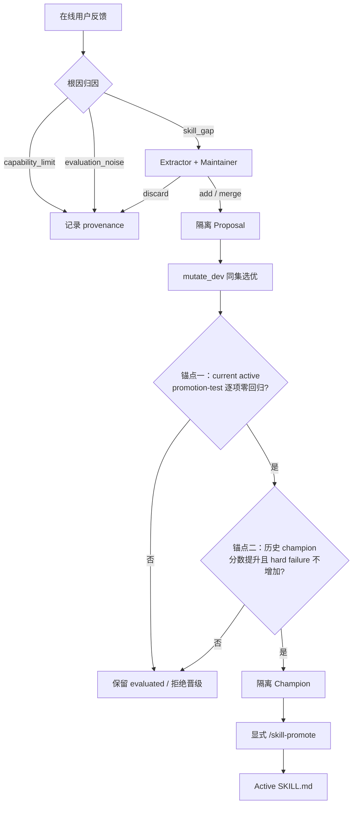
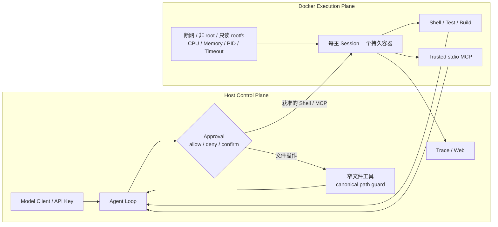

# Bear Code 阶段性改进记录

本文按功能分支合入 `main` 的顺序，记录 Bear Code 每个阶段相对合入前主线的真实增量。它服务于代码复盘和互联网大厂面试：重点不是罗列提交文件，而是回答“原来有什么、这次解决了什么、机制如何工作、证据是什么”。

运行流程仍以 [`RUNTIME_FLOW.md`](../RUNTIME_FLOW.md) 为唯一真相源；本文是面向演进历史和面试叙事的派生档案。

## 维护规则

每次功能分支合入 `main` 前必须完成以下动作；如果已经合并，则在同次合并收尾中补记：

1. 用功能提交及其直接父提交，或 merge commit 的两个父提交，确定不可漂移的比较基线；不能只比较会继续移动的分支名。
2. 在“阶段索引”追加一行，并在文末按下面的固定模板新增阶段。
3. 必须先列“原有能力”，再列“实际新增”，避免把已有能力重新包装成创新。
4. 必须记录核心机制、非新增能力、局限、验证证据和面试表达。
5. 同步更新 `RUNTIME_FLOW.md` 变更账本；涉及命令、架构或用户行为时同步更新 README 和相关 wiki。

固定模板：

```text
## 阶段 N：<名称>
### 1. 提交与基线
### 2. 合入前已经具备的能力
### 3. 本阶段实际新增的能力
### 4. 核心机制
### 5. 不能算作本阶段新增的能力
### 6. 验证证据
### 7. 当前局限
### 8. 面试表达
```

## 阶段索引

| 阶段 | 功能提交 | 合入前 `main` | merge commit | 真实增量 |
| --- | --- | --- | --- | --- |
| 1. `skillevo` | `0cf5da654e0784a482fb18208d1f6b64ff59a6b7` | `6b2658eaaf095bfc5df11d2d922492eedd5e7915` | `320c11f324b621ecba93d6e044eae3c67275c778` | 为已有在线 Skill 演化增加 candidate-first 治理：归因、隔离 proposal、逐项回归、双锚点和显式发布 |
| 2. `sandbox` | `f14c2d6c2955ee1d47310b33eca001daa0db5836` | `320c11f324b621ecba93d6e044eae3c67275c778` | `c4a956bb1a8c921bb95a9b076a2b0c1fb32091f0` | 将应用层审批升级为 Approval 与执行隔离分层，引入会话级 Docker Action Runtime、路径边界和安全评测 |

## 阶段 1：`skillevo`——为在线 Skill 演化增加发布前治理

### 1. 提交与基线

| 项目 | 内容 |
| --- | --- |
| 功能提交 | `0cf5da654e0784a482fb18208d1f6b64ff59a6b7` |
| 直接父提交 / 合入前 `main` | `6b2658eaaf095bfc5df11d2d922492eedd5e7915` |
| merge commit | `320c11f324b621ecba93d6e044eae3c67275c778` |
| 变更规模 | 18 个文件，新增 1604 行、删除 273 行 |

### 2. 合入前已经具备的能力

Bear Code 原来已经是一个会在线演化 Skill 的 Harness，并非在本阶段才获得自进化能力。原主线已经具备：

- 跨轮保存“用户问题、Agent 回答、用户反馈”的 pending feedback window；
- Extractor 从真实反馈中提取可复用 Skill 候选；
- Maintainer 结合现有 Skill 集合做 `add / merge / discard`；
- 写权限通过后调用 `create_skill()` 或 `evolve_skill()`，直接修改 active `SKILL.md`；
- provenance、usage 和版本历史记录；
- replay、programmatic rule、可选 LLM judge；
- heuristic/LLM candidate、`mutate_dev / promotion_test` 数据划分；
- usage/status gate 和不覆盖 active 文件的本地 champion registry。

原流程的关键缺口不是“不能在线演化”，而是在线演化与在线评测没有形成发布前闭环：写权限解决了“能不能写”，没有解决“这个版本应不应该上线”。

### 3. 本阶段实际新增的能力

#### 3.1 可修复性归因

反馈先分类为：

- `skill_gap`：缺少可复用规则或流程，允许生成 Skill 候选；
- `capability_limit`：模型、工具或上下文能力不足，只记录证据；
- `evaluation_noise`：证据不足、偶发偏好或评价噪声，只记录证据。

只有 `skill_gap` 进入 Maintainer，减少用 Skill 修改错误修复模型或工具问题的过拟合。

#### 3.2 隔离 Proposal 与生命周期

Maintainer 的 `add / merge` 不再直接调用 active Skill 写接口，而是保存完整候选快照到：

```text
.bear/skill-evolution/proposals.json
.bear/skill-evolution/proposals/<proposal-id>/proposal.json
.bear/skill-evolution/proposals/<proposal-id>/SKILL.md
```

proposal 不在 `discover_skills()` 的 active 发现目录中，不会进入 System Prompt。生命周期被持久化为：

```text
pending → evaluated → champion → published
```

#### 3.3 将在线 Proposal 接入候选评测池

原有候选池从 heuristic 和 LLM mutation 扩展为：

```text
online proposal + heuristic candidate + LLM candidate
```

评测规则同时守住 active Skill 的既有约束，并验证最新 proposal 的新增约束。新 Skill 尚无 active 版本时，可以用 proposal 快照定义评测目标，但候选仍保持隔离。

#### 3.4 同样本逐项回归

候选先在 `mutate_dev` 上和 current active 的同一批样本比较；只让 dev 最优候选进入隔离的 `promotion_test`。在 test 上按 `(sample_id, rule_id)` 对齐结果：

```text
current active = pass
candidate      = fail 或缺失
=> regression
```

默认要求 hard regression 为 0、总回归率为 0，避免平均分上涨掩盖某项已有能力退化。

#### 3.5 显式发布

`/skill-eval` 只允许候选成为隔离 champion，不修改 active Skill。新增：

```text
/skill-proposals
/skill-promote <skill-name>
```

只有 `/skill-promote` 会根据 champion 快照调用 `create_skill()` 或 `evolve_skill()`，更新 proposal 为 `published` 并刷新 Runtime System Prompt。`--accept-edits` 和 `--yolo` 都不能让后台 proposal 自动生效。

### 4. 核心机制



双锚点的精确定义：

| 锚点 | 基准 | 回答的问题 | 比较方式 |
| --- | --- | --- | --- |
| current active | 当前线上正在生效的 Skill | 候选有没有丢掉当前已有能力？ | 同一 promotion-test 上按 `sample_id + rule_id` 逐项检查，默认零回归 |
| historical champion | lineage 中已保存的历史最佳版本 | 候选是否达到新的历史最佳？ | 平均分达到最小增益，且 hard failure 不增加 |

`mutate_dev` 和 `promotion_test` 是开发集与晋级测试集，不是“双锚点”。第一锚点负责安全，第二锚点负责持续进步。

### 5. 不能算作本阶段新增的能力

- 不能说“实现了在线 Skill 演化”：原主线已经能从反馈直接 add/merge active Skill。
- 不能说“首次实现 replay 或 dev/test 隔离”：原主线已经存在。
- 不能说“首次实现 champion”：原主线已经有本地 champion registry。
- 更准确的说法是：把已有的 current/champion 比较收敛为可审计的两级门禁，并将真实在线 proposal 接入发布前评测。

### 6. 验证证据

- 提交内记录的全量测试结果：`pytest` 36 passed；
- Ruff E9/F 与 `git diff --check` 通过；
- 测试覆盖三类归因、不可修复反馈不进入 Maintainer；
- 覆盖 proposal 暂存、状态流转和未发布时 active 不变；
- 覆盖 proposal 进入候选池、评测后成为 champion；
- 覆盖逐样本/规则回归、hard regression 阻断和零回归通过；
- 覆盖无合格 champion 时拒绝发布、合格 champion 显式发布。

### 7. 当前局限

- 归因和规则抽取仍依赖模型输出质量，错误归因只能通过保守 fallback 与审计缓解；
- 在线 replay 可能稀疏或带有真实流量偏差，不能替代稳定的人工基准集；
- historical champion 使用持久化汇总指标，跨评测运行不一定拥有完全相同的样本组成；
- proposal 发布仍需显式命令，当前没有上线后的自动监控与自动回滚闭环。

### 8. 面试表达

一句话版本：

> Bear Code 原来已经能从在线反馈中自动新增或合并 Skill；我在此基础上增加了 candidate-first 的演化治理层，把直接修改改为根因归因、隔离 proposal、同样本逐项回归、历史 champion 晋级和显式发布，解决在线自进化中的误归因、过拟合与能力回退问题。

展开版本：

> 我首先把写权限和质量准入分开：权限只说明系统允许写文件，不代表候选值得上线。在线反馈只有归因为 skill gap 才生成 proposal；proposal 不进入 active Skill 目录，而是与 heuristic、LLM 候选一起做 replay。候选先在 dev 上选优，再以 current active 为安全锚点做逐样本零回归，最后以历史 champion 为进步锚点做版本晋级。评测只产生隔离 champion，必须显式 promote 才会修改 active Skill。

## 阶段 2：`sandbox`——从应用层审批升级为真实执行边界

### 1. 提交与基线

| 项目 | 内容 |
| --- | --- |
| 功能提交 | `f14c2d6c2955ee1d47310b33eca001daa0db5836` |
| 直接父提交 / 合入前 `main` | `320c11f324b621ecba93d6e044eae3c67275c778` |
| merge commit | `c4a956bb1a8c921bb95a9b076a2b0c1fb32091f0` |
| 变更规模 | 21 个文件，新增 2101 行、删除 194 行 |

### 2. 合入前已经具备的能力

原主线已经具备：

- Agent Loop、工具 schema、tool call 路由和结果回写；
- `default / acceptEdits / plan / bypassPermissions / dontAsk` 权限模式；
- permission rule、危险 Shell 正则和用户确认；
- Shell 的异步执行、超时与进程组清理；
- 文件工具的编辑前读取、mtime 一致性检查；
- MCP stdio 进程和项目/用户配置加载；
- Runtime event、Web 会话和 Trace；
- 一个用于打包完整 Harness 的旧 `Dockerfile`。

但获准的 Shell 和 MCP 最终仍直接在宿主机执行。危险命令检测和用户确认属于应用层策略，不是进程访问边界；`bypassPermissions` 会跳过审批，宿主 subprocess 仍可能看到 Home、环境变量、Docker Socket 和 workspace 外文件。旧 Dockerfile 把整个 Harness 放进容器，也没有将模型控制面和动作执行面分开。

### 3. 本阶段实际新增的能力

#### 3.1 控制面与执行面分离

模型客户端、API Key、Agent Loop、Approval 和 Trace 留在宿主控制面；Shell、测试构建和已信任的 stdio MCP 进入 Docker 执行面。每个主 Session 懒创建一个持久容器，子 Agent 共享该 Sandbox Session，退出时统一销毁。

#### 3.2 Approval 与 Sandbox 分层

Approval 继续回答“用户是否同意这次操作”；Sandbox 回答“操作被允许后技术上最多能访问什么”。因此：

- `--yolo` / `bypassPermissions` 只跳过询问，不能跳出容器；
- 只有进程启动时显式 `--unsafe-local` 才关闭 Docker 隔离；
- Docker CLI 或镜像不可用时 fail closed，不静默回退宿主执行；
- Plan Mode 同时阻断 Shell 和 MCP。

#### 3.3 会话级 Docker Action Runtime

新增 `SandboxConfig`、`SandboxSession`、`ExecRequest` 和 `ExecResult`，提供：

- workspace 唯一读写 bind mount，容器工作目录为 `/workspace`；
- 默认 `network=none`、非 root UID、只读 rootfs；
- `cap-drop=ALL`、`no-new-privileges`；
- CPU、内存、PID、命令超时和输出大小限制；
- `/tmp` 使用 tmpfs；
- 超时或取消时重启整个容器，清理派生进程树但保留 workspace 修改；
- 命令输出、退出码、耗时、截断和执行 ID 的结构化回执。

#### 3.4 宿主文件工具路径收口

精确文件工具仍在宿主侧运行，但所有路径先 canonicalize，只允许 workspace 和明确 Runtime 目录。绝对路径越界、`..` 和符号链接逃逸会被拒绝，并且 `bypassPermissions` 不能绕过这层检查。

#### 3.5 MCP 信任与环境隔离

项目 MCP 配置首次加载前需要会话级信任；拒绝时只加载用户级配置。获信任的 stdio Server 在同一个 Sandbox 中启动，只接收配置显式声明的环境变量，不继承完整宿主 `os.environ`。

#### 3.6 可观测性与可重复安全评测

新增 Sandbox 生命周期、执行、违规和重启事件；Shell Trace 保存摘要与命令哈希，不记录完整命令。Web 显示 `not-started / running / stopped / closed / unsafe-local` 状态。演示脚本和评测报告覆盖攻击用例、cold start、warm P95、输出截断与超时进程树清理。

### 4. 核心机制



两层安全边界：

| 层 | 核心问题 | 机制 |
| --- | --- | --- |
| Approval | 这次动作是否符合用户意图？ | 权限模式、规则、风险判断、用户确认 |
| Sandbox | 获准动作实际上能访问什么？ | mount、namespace、UID、capability、network 与资源限制 |

### 5. 不能算作本阶段新增的能力

- 不能说“首次实现工具权限”：原主线已经有 permission mode、规则和确认。
- 不能说“首次支持 Docker”：原主线已经有完整 Harness 镜像的 Dockerfile。
- 不能说“首次实现 Shell 超时或 Web Trace”：这些基础设施原来已经存在。
- 更准确的说法是：把已有审批层与新的动作执行边界分离，并让 Shell、可信 MCP、宿主文件窄接口和可观测性共同遵守这条边界。

### 6. 验证证据

- 提交内记录的全量 Python 测试：53 passed；
- 1 个真实 Docker integration test 因验证机器没有 Docker CLI 而明确 skipped，没有伪造结果；
- Web production build、相关 Python Ruff E9/F、全量 Python 编译与 `git diff --check` 通过；
- 自动测试覆盖绝对路径、`..`、符号链接逃逸和 bypassPermissions 不绕过路径边界；
- 覆盖 Plan Mode 阻断 Shell/MCP、无 Sandbox 时 fail closed、Docker hardening 参数；
- 覆盖输出上限、超时重启、生命周期状态、MCP 信任与环境变量隔离；
- 覆盖子 Agent 共享 Sandbox、Web 状态和事件摘要脱敏。

### 7. 当前局限

- 这是单用户本地 Demo 的爆炸半径控制，不是多租户强隔离或安全认证；
- workspace 是读写 bind mount，其中的 `.env` 等 Secret 文件仍对容器可见；
- Docker daemon 和宿主内核仍是信任根，不防 Docker 或内核逃逸；
- 网络目前主要是开/关，没有域名 allowlist、代理或凭据 broker；
- 容器重启会终止同 Session MCP，当前没有自动重连；
- 没有 copy-on-write workspace、checkpoint、远程 Sandbox Provider 或 microVM。

### 8. 面试表达

一句话版本：

> Bear Code 原来只有应用层 permission check；我把控制面和执行面拆开，让模型密钥、Agent Loop、Approval 与 Trace 留在宿主，把获准的 Shell 和可信 MCP 放进每会话一个持久 Docker Sandbox，使 `--yolo` 只能跳过询问而不能扩大实际访问边界。

展开版本：

> 我没有继续堆危险命令正则，因为 Python、包管理器脚本或编译后二进制都能绕过文本匹配。我保留 Approval 处理用户意图，再用 Docker 的 mount、network、UID、capability 和资源限制处理技术边界。文件工具因为需要精确编辑和 mtime 保护，仍作为宿主窄接口，但增加 canonical path 与符号链接逃逸检查。命令超时会重启整个会话容器清理进程树，Web 和 Trace 展示真实生命周期。这个方案定位为单用户 Coding Agent Demo，不宣称生产多租户隔离。
